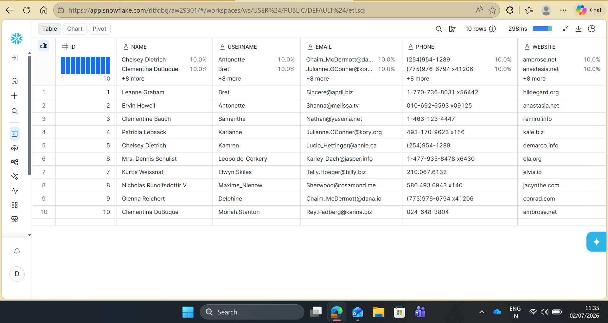
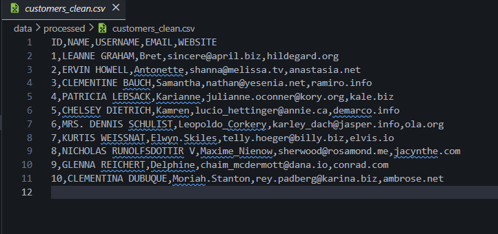

# Customer ETL Pipeline using Apache Airflow & Snowflake


---

# Project Overview
This project demonstrates an **End-to-End ETL (Extract, Transform, Load) Pipeline** built using **Python, Apache Airflow, Snowflake, SQL, Docker, and REST APIs**.

The pipeline extracts customer data from a public REST API, stages it in the **Bronze layer**, performs data cleansing and standardization in the **Silver layer**, enriches the data into an **analytics-ready Gold layer**, validates the transformed data, and exports the processed dataset for downstream analytics.

Apache Airflow orchestrates the complete workflow while Docker provides a reproducible execution environment. The project follows the **Medallion Architecture (Bronze → Silver → Gold)** commonly used in modern Data Engineering.

---


# Architecture

```text
                    REST API
                       │
                       ▼
             Python Extraction
                       │
                       ▼
            Raw JSON / CSV Files
                       │
                       ▼
            Apache Airflow Pipeline
                       │
                       ▼
      Snowflake Bronze Layer
     (BRONZE.CUSTOMER_RAW)
                       │
                       ▼
       SQL Data Cleaning &
      Standardization
                       │
                       ▼
      Snowflake Silver Layer
   (SILVER.CUSTOMER_CLEAN)
                       │
                       ▼
   Business Transformations
  (Email Provider Extraction)
                       │
                       ▼
      Snowflake Gold Layer
 (GOLD.CUSTOMER_ANALYTICS)
                       │
                       ▼
 Validation & Processed CSV Export
```

---

# Tech Stack

| Category | Technologies |
|----------|--------------|
| Programming Language | Python |
| Workflow Orchestration | Apache Airflow |
| Data Warehouse | Snowflake |
| Data Processing | Pandas |
| Database Language | SQL |
| Containerization | Docker |
| Version Control | Git, GitHub |
| Operating System | Linux (WSL)|
| Data Source | REST API (JSONPlaceholder) |

---

# Project Workflow

## Step 1 — Extract

- Fetch customer data from the JSONPlaceholder REST API.
- Store the raw response as JSON.
- Convert JSON into CSV format.

---

## Step 2 — Load

- Read the extracted CSV file.
- Load raw customer records into the **Bronze** schema in Snowflake.
- Preserve source data for auditing and traceability.

---

## Step 3 — Transform

- Clean and standardize customer data.
- Remove duplicate records.
- Normalize names and email addresses.
- Populate the **Silver** schema.

---

## Step 4 — Analytics

- Create the analytics-ready Gold layer.
- Derive **EMAIL_PROVIDER** using SQL.
- Prepare curated datasets for reporting and downstream analytics.
- Store business-ready data in `GOLD.CUSTOMER_ANALYTICS`.

## Step 5 — Validate

- Verify row counts.
- Validate successful data loading.
- Export the Gold dataset to CSV.

---
# Medallion Architecture

The project follows the **Bronze → Silver → Gold** Medallion Architecture for incremental data refinement.

| Layer | Purpose |
|--------|---------|
| Bronze | Stores raw customer records exactly as received from the source API. |
| Silver | Cleans, standardizes, validates, and removes duplicate customer records. |
| Gold | Creates analytics-ready datasets by enriching customer data with derived attributes such as **EMAIL_PROVIDER** for reporting and business analysis. |
# Pipeline Flow

```text
Extract Customers
        │
        ▼
Load Bronze Layer
        │
        ▼
Transform to Silver
        │
        ▼
Transform to Gold
        │
        ▼
Validate & Export
```

---

# Project Structure

```text
customer-etl-pipeline/
│
├── dags/
│   └── customer_etl_pipeline.py
│
├── etl/
│   ├── extract.py
│   ├── load.py
│   ├── transform.py
│   └── validate.py
│
├── sql/
│   ├── create_tables.sql
│   ├── transformations.sql
│   └── analytics.sql
│
├── data/
│   ├── raw/
│   │   ├── customers.csv
│   │   └── customers.json
│   │
│   └── processed/
│       └── customers_clean.csv
│
├── config/
├── plugins/
├── logs/
├── images/
│
├── docker-compose.yaml
├── requirements.txt
├── .gitignore
└── README.md
```

# Airflow DAG

> Add a screenshot after pushing the project.


---

# Snowflake BRONZE Layer

Example:

```sql
SELECT * FROM CUSTOMER_DB.BRONZE.CUSTOMER_RAW;
```

Add Screenshot:




---
# Snowflake Silver Layer

```sql
SELECT * FROM CUSTOMER_DB.SILVER.CUSTOMER_CLEAN;
```

Add Screenshot


# Snowflake Gold Layer

```sql
SELECT * FROM CUSTOMER_DB.GOLD.CUSTOMER_ANALYTICS;
```

Add Screenshot


---

# Processed Dataset

The pipeline exports the final cleaned dataset to:

```text
data/processed/customers_clean.csv
```

Add Screenshot:





---
---


# Features

- End-to-End ETL Pipeline
- Medallion Architecture (Bronze–Silver–Gold)
- Apache Airflow Workflow Orchestration
- Snowflake Data Warehouse Integration
- SQL-based Data Transformation
- Customer Data Standardization
- Email Provider Analytics
- Automated Data Validation
- Processed CSV Export
- Dockerized Development Environment
- Modular Python Architecture
- Scalable Project Structure

---

# How to Run

## Clone Repository

```bash
git clone https://github.com/erdipayanlodh/customer_etl.git
```

---

## Navigate to Project

```bash
cd customer-etl-pipeline
```

---

## Start Docker Containers

```bash
docker compose up -d
```

---

## Open Airflow

```text
http://localhost:8080
```

Default Credentials

```
Username: airflow
Password: airflow
```

---

## Trigger the Pipeline

Run the DAG

```
customer_etl_pipeline
```

The workflow will execute:

- Extract
- Load
- Transform
- Validate

---

# Sample Output

After successful execution:

✔ Customer data extracted

✔ Raw data loaded into Snowflake

✔ Bronze layer loaded

✔ Silver layer created

✔ Gold analytics layer generated

✔ Processed analytics CSV exported

✔ Data validated

✔ Processed CSV generated

---

# Future Improvements

- Integrate dbt for SQL transformations
- Implement CI using GitHub Actions
- Integrate Azure Blob Storage


---

# Skills Demonstrated

- ETL Pipeline Development
- Apache Airflow
- Snowflake
- SQL
- Python
- REST API Integration
- Docker
- Data Validation
- Workflow Orchestration
- Data Warehousing
- Git & GitHub

---

# Author

## Dipayan Lodh

Computer Science Engineer | Data Engineering Enthusiast

GitHub: https://github.com/erdipayanlodh

LinkedIn: https://www.linkedin.com/in/dipayan-lodh-855111212/

---

## If you found this project helpful, consider giving it a ⭐ on GitHub.
