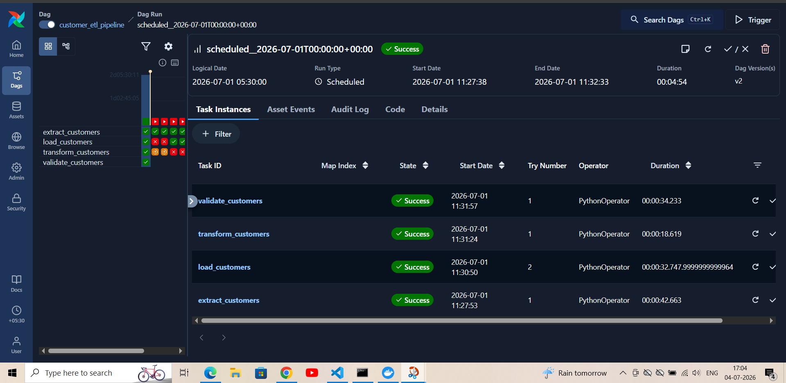

# Customer ETL Pipeline using Apache Airflow & Snowflake


---

# Project Overview

This project demonstrates an **End-to-End ETL (Extract, Transform, Load) Pipeline** built using **Python, Apache Airflow, Snowflake, SQL, Docker, and REST APIs**.

The pipeline automatically extracts customer data from a public REST API, stores the raw data locally, loads it into Snowflake, performs SQL-based transformations to create analytics-ready datasets, validates the processed data, and exports the final cleaned dataset.

Apache Airflow orchestrates the complete workflow, while Docker provides a reproducible and isolated execution environment.

---

# Architecture

```text
                    REST API
                       │
                       ▼
             Python Extraction
                       │
                       ▼
             Raw JSON / CSV Files
                       │
                       ▼
              Apache Airflow DAG
                       │
                       ▼
          Snowflake RAW Layer
                       │
                       ▼
         SQL Data Transformation
                       │
                       ▼
      Snowflake ANALYTICS Layer
                       │
                       ▼
          Data Validation & Export
                       │
                       ▼
          Processed Customer CSV
```

---

# Tech Stack

| Category | Technologies |
|----------|--------------|
| Programming Language | Python |
| Workflow Orchestration | Apache Airflow |
| Data Warehouse | Snowflake |
| Data Processing | Pandas |
| Database Language | SQL |
| Containerization | Docker |
| Version Control | Git, GitHub |
| Operating System | Linux |
| Data Source | REST API (JSONPlaceholder) |

---

# Project Workflow

## Step 1 — Extract

- Fetch customer data from the JSONPlaceholder REST API.
- Store the raw response as JSON.
- Convert JSON into CSV format.

---

## Step 2 — Load

- Read the raw CSV file.
- Connect to Snowflake using Airflow's Snowflake Hook.
- Load customer records into the **RAW** schema.

---

## Step 3 — Transform

- Execute SQL transformation scripts.
- Clean and standardize customer data.
- Create analytics-ready tables in the **ANALYTICS** schema.

---

## Step 4 — Validate

- Verify row counts.
- Check for duplicate customer IDs.
- Confirm successful transformation.
- Export the processed dataset as CSV.

---

# Pipeline Flow

```text
Extract Customers
        │
        ▼
Load into Snowflake
        │
        ▼
Transform Data
        │
        ▼
Validate Data
        │
        ▼
Export Processed CSV
```

---

# Project Structure

```text
customer-etl-pipeline/
│
├── dags/
│   └── customer_etl_pipeline.py
│
├── etl/
│   ├── extract.py
│   ├── load.py
│   ├── transform.py
│   └── validate.py
│
├── sql/
│   ├── create_tables.sql
│   ├── transformations.sql
│   └── analytics.sql
│
├── data/
│   ├── raw/
│   │   ├── customers.csv
│   │   └── customers.json
│   │
│   └── processed/
│       └── customers_clean.csv
│
├── config/
├── plugins/
├── logs/
├── images/
│
├── docker-compose.yaml
├── requirements.txt
├── .gitignore
└── README.md
```

---

# Airflow DAG

> Add a screenshot after pushing the project.

```markdown

```

---

# Snowflake RAW Layer

Example:

```sql
SELECT * FROM CUSTOMER_DB.RAW.CUSTOMER_RAW;
```

Add Screenshot:

```markdown

```

---

# Snowflake Analytics Layer

Example:

```sql
SELECT * FROM CUSTOMER_DB.ANALYTICS.CUSTOMERS_CLEAN;
```

Add Screenshot:

```markdown

```

---

# Processed Dataset

The pipeline exports the final cleaned dataset to:

```text
data/processed/customers_clean.csv
```

Add Screenshot:

```markdown

```

---

# Features

- End-to-End ETL Pipeline
- Apache Airflow Workflow Orchestration
- Snowflake Data Warehouse Integration
- Modular Python ETL Scripts
- SQL-based Data Transformation
- Automated Data Validation
- Processed CSV Export
- Dockerized Development Environment
- Scalable Project Structure

---

# How to Run

## Clone Repository

```bash
git clone https://github.com/erdipayanlodh/customer_etl.git
```

---

## Navigate to Project

```bash
cd customer-etl-pipeline
```

---

## Start Docker Containers

```bash
docker compose up -d
```

---

## Open Airflow

```text
http://localhost:8080
```

Default Credentials

```
Username: airflow
Password: airflow
```

---

## Trigger the Pipeline

Run the DAG

```
customer_etl_pipeline
```

The workflow will execute:

- Extract
- Load
- Transform
- Validate

---

# Sample Output

After successful execution:

✔ Customer data extracted

✔ Raw data loaded into Snowflake

✔ Analytics table created

✔ Data validated

✔ Processed CSV generated

---

# Future Improvements

- Integrate dbt for SQL transformations
- Implement CI using GitHub Actions
- Add Incremental Data Loading
- Integrate AWS S3
- Add Data Quality Tests
- Build a Monitoring Dashboard
- Parameterize the Airflow DAG
- Deploy using Kubernetes

---

# Skills Demonstrated

- ETL Pipeline Development
- Apache Airflow
- Snowflake
- SQL
- Python
- REST API Integration
- Docker
- Data Validation
- Workflow Orchestration
- Data Warehousing
- Git & GitHub

---

# Author

## Dipayan Lodh

Computer Science Engineer | Data Engineering Enthusiast

GitHub: https://github.com/erdipayanlodh

LinkedIn: https://www.linkedin.com/in/dipayan-lodh-855111212/

---

## If you found this project helpful, consider giving it a ⭐ on GitHub.